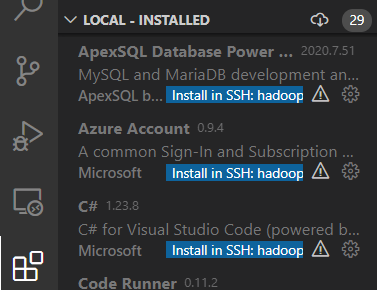
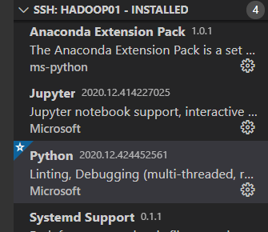
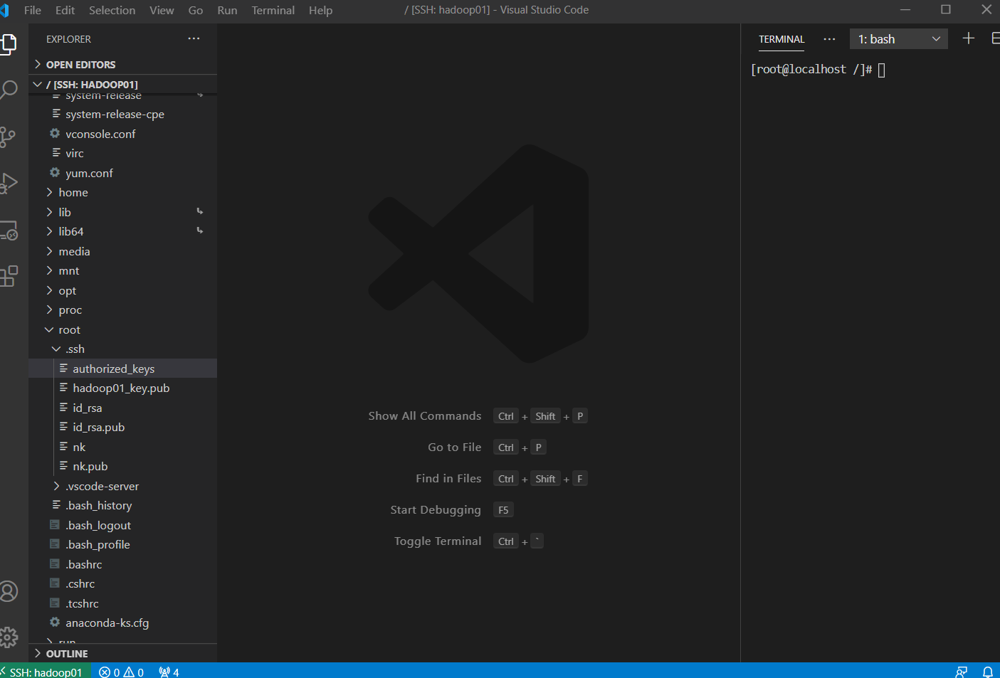
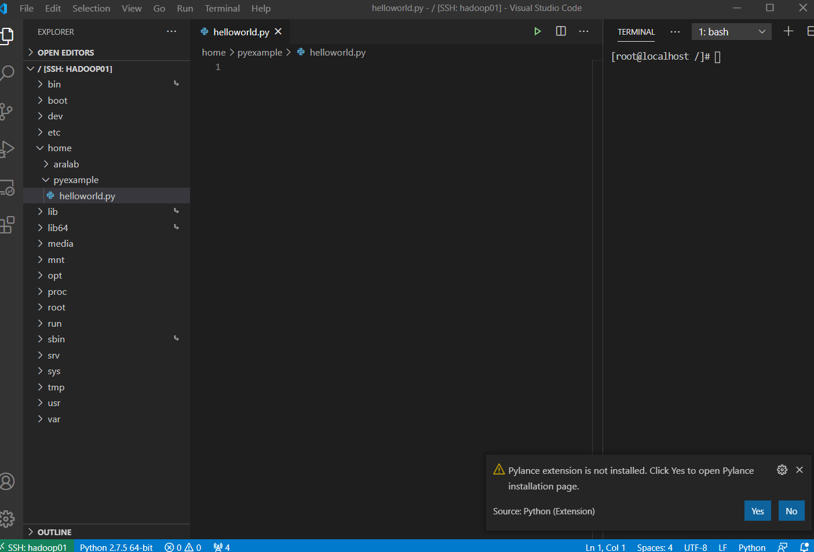
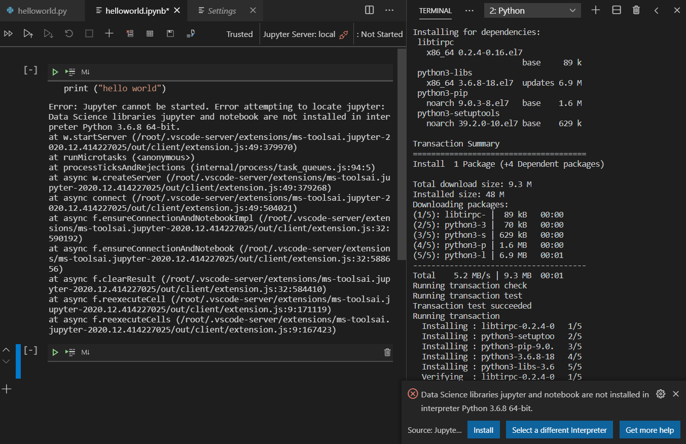

 - [1. 리눅스 가상머신 설치 및 Remote 원격제어 구축](1_linux.md)
    - [번외 : VSCode Remote를 이용한 리눅스 환경에서 파이썬 실행](1_1_Pylinux.md)
 - [2. ELK스택 설치 및 Logstash 파이프라인 구축](2_ELK.md)
 - [3. Hadoop 설치 및 데이터 로드/언로드](3_Hadoop.md)
 - [4. Metricbeat를 이용한 원격 클러스터 모니터링 시스템 구축](4_remote.md)
 - [5. Kafka와 Zookeeper 설치 및 로그 파이프라인 구축](5_kafka.md)
 - [6. Spark 개발환경의 구축](6_spark.md)


<br><br><br>

# 번외 : VSCode Remote를 이용한 리눅스 환경에서 파이썬 실행

VSCode Remote는 원격에서의 코드 실행이 가능하다. **실행방식은 윈도우에서 실행시킬 때와 차이가 1도 없다**.

윈도우에서 파이썬 코드를 실행시키는 절차는 아래와 같다.
1. VSCode 켜서 Python 플러그인 설치
2. 인터프리터 지정 후
3. 실행

리눅스에서도 똑같다.
1. VSCode-Remote로 접속 후 원격지에 Python 플러그인 설치
2. 인터프리터 지정 후
3. 실행

## 1. 원격지(리눅스)에 플러그인 설치
먼저 [저번 글](linux.md)에서 설정한 대로 Remote로 접속된 리눅스 창을 띄우자.


저번글에서 그림을 그대로 가져왔다. 왼쪽에, 윈도우 때와 똑같이 Extension 탭이 보인다. 그리고 열어보면



저렇게 로컬(윈도우)에서 깔려있는 플러그인이 보인다. 그리고 install이 있던 부분이 Install in SSH: xxx로 되어있다. 플러그인을 눌러보면 아래와 같은 창이 뜬다.


저렇게 로컬에 깔려있지만 리눅스에 깔려있지 않은 플러그인은 install in SSH:xxx로 되어있다. 저걸 누르면 리눅스에 설치가 진행되고



저렇게 설치 완료된 플러그인 목록에 뜬다. 파이썬을 그냥 깔면 끝인거다. 다만, 원격지에서 까는 것인 만큼 윈도우처럼 빠릿빠릿하지 않다. 설치버튼 눌렀는데 반응 없다고 막 더 눌렀다간 오히려 부작용만 커지니 참을성 있게 설치하자.

## 2. 파이썬 파일 생성, 인터프리터 설정, python3으로 실행
일단, 또 어디든 들어갈 수 있는 만능 Remote로 만들기 위해 아래 명령어를 입력하자
```
code /
```
그리고 다시 ssh 인증을 밟으면 아래처럼 뜰 거다. 



터미널을 오른쪽으로 옮겼는데, 저렇게 하면 가로로 길쭉한 모니터에서 작업공간을 넓게 쓸 수 있다는 장점이 있다.

모니터를 세우면 되지 않냐고? 조용.

그리고 적당한 디렉토리를 하나 만들고 그곳에 helloworld.py 파일을 만든다. 그러면 거의 99%의 확률로 플러그인 뭐 하나가 빠졌다고 뜰 텐데, 깔아주면 된다. 아래 사진에서는 파이썬 문법검사를 하는데 쓰이는 Pylance 플러그인이 빠졌다.



어쨌든 플러그인들이 다 깔려있다면, 언제나 환경이 잘 갖추어졌는지 검사하는 기본 프로그램, hello world를 작성한다. 아래처럼

```python
print("hello world")
```
그리고 우상단의 'run python in terminal'을 실행시킨다. 윈도우랑 그냥 똑같다. 터미널에는 아래 결과가 출력될 것이다.

```bash
[root@localhost /]# /usr/bin/python2.7 /home/pyexample/helloworld.py
hello world
```
자동으로 파이썬 명령어를 만들어준건 좋은데, python 2.7이 심하게 거슬린다. python3으로 업그레이드해야 할 필요가 있다.

```bash
yum -y install python3
```
파이썬은 오픈소스 진영이 사랑하는 언어고, 당연히 yum 저장소에도 등록되어 있다. 실행시켜서 설치하자 얼른.

설치하고 나서 다시 run python in terminal을 실행시키면...
```bash
[root@localhost /]# /usr/bin/python2.7 /home/pyexample/helloworld.py
hello world
```
아 저기요 윈도우는 깔기만 하면 됐는데 왜


명령창에서 python:select interpreter를 눌러 설정에 들어가보면, 새로 깐 python3이 목록에 없고 2.7.5만 존재하는 걸 볼 수 있다. 아나콘다 환경도 어떻게 해볼 수 있을 것 같지만, 지금은 일단 Python3을 켜놓는게 우선이니, Enter interpreter path를 눌러 다음 경로를 찾아 들어간다.

```bash
usr/bin/python3.6
```
그러고 다시 실행시키면
```bash
[root@localhost /]# /usr/bin/python3.6 /home/pyexample/helloworld.py
hello world
```
편-안

이로써 리눅스 환경에서 파이썬 실행시킬 준비는 끝났다. 뭔가 너무 쉬워서 찝찝한 느낌인데, 문제가 터지면 그때 가서 해결하자.

아나콘다 환경이 리눅스에 존재한다면, 아마 그 아나콘다 경로로 들어가서 걸어주면 OK일 거다. 해보진 않았지만 아마 그럴거야....

## 3. Jupyter notebook 실행
다 잘 풀릴줄 알았는데 주피터 노트북 (.ipynb)는 실행이 또 안된다(...) 일단, 실행버튼 누르면 오류가 주르륵 뜨고, 노트북 실행에 필요한 라이브러리를 설치하겠냐는 창이 우하단에 뜬다.



설치해주고 나서 실행시키면 주피터 서버가 실행을 시작하는데...

```
Jupyter notebook failed to launch. 
Error: Traceback (most recent call last):
  File "/root/.vscode-server/extensions/ms-toolsai.jupyter-2020.12.414227025/pythonFiles/vscode_datascience_helpers/daemon/daemon_python.py", line 54, in _decorator
    return func(self, *args, **kwargs)
  File "/root/.vscode-server/extensions/ms-toolsai.jupyter-2020.12.414227025/pythonFiles/vscode_datascience_helpers/jupyter_daemon.py", line 108, in m_exec_module_observable
    self._start_notebook(args, cwd, env)
  File "/root/.vscode-server/extensions/ms-toolsai.jupyter-2020.12.414227025/pythonFiles/vscode_datascience_helpers/jupyter_daemon.py", line 162, in _start_notebook
    app.launch_new_instance()
  File "/root/.local/lib/python3.6/site-packages/jupyter_core/application.py", line 254, in launch_instance
    return super(JupyterApp, cls).launch_instance(argv=argv, **kwargs)
  File "/root/.local/lib/python3.6/site-packages/traitlets/config/application.py", line 664, in launch_instance
    app.start()
  File "/root/.local/lib/python3.6/site-packages/notebook/notebookapp.py", line 2253, in start
    self.exit(1)
  File "/root/.local/lib/python3.6/site-packages/traitlets/config/application.py", line 654, in exit
    sys.exit(exit_status)
SystemExit: 1

[I 20:24:05.864 NotebookApp] The port 8888 is already in use, trying another port.


[C 20:24:05.866 NotebookApp] Running as root is not recommended. Use --allow-root to bypass.


Failed to run jupyter as observable with args notebook --no-browser --notebook-dir="/" --config=/tmp/77b49493-def4-4571-b5fa-f98b9b4421c2/jupyter_notebook_config.py --NotebookApp.iopub_data_rate_limit=10000000000.0

```
또 오류난다. 루트로 실행하지 말라는데... 우리 이거 명령어로 실행시키는거 아니라 플러그인으로 실행시키는건데?

저기서 메세지를 보면 실행시 ```--allow-root```를 넣어주어야 root에서 jupyter 서버 구동이 가능하다고 한다. 간단하다. 실행 명령에 저걸 집어넣어주면 된다. 그런데... 어떻게?


extension탭의 Jupyter 옆에 있는 톱니바퀴를 누르고 Extension Settings로 들어가 설정창을 열자. 그리고 아래 항목을 찾는다.


저기서 Edit in settings.json을 누르면 설정 파일이 열리면서 항목을 수정할 수 있게 뜬다. 거기에서 이제 수정할 수 있게 커서가 위치해 있을 텐데, 아래와 같이 괄호 속에 실행 명령어를 같이 입력해주자.

```
...
"jupyter.jupyterCommandLineArguments": [        
    "--allow-root"
]
...
```
이제 실행시킬 때 --allow-root를 뒤에 붙여서 실행시킬테니, 멀쩡히 동작할 수 있을 것이다. 루트로 하면 모든게 편안할 줄 알았는데, 저런 문제가...

json파일을 저장하면 창을 reload해달라고 뜰 텐데, 하고 다시 ssh인증을 밟아준 뒤 노트북 파일로 가서 실행하면 노트북이 잘 작동할 것이다.

왠지 파이썬만 돌릴땐 너무 문제없이 잘 되더라. 역시나 함정이 숨어있네...

