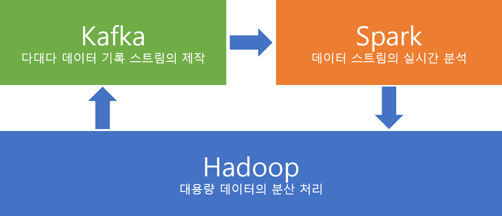
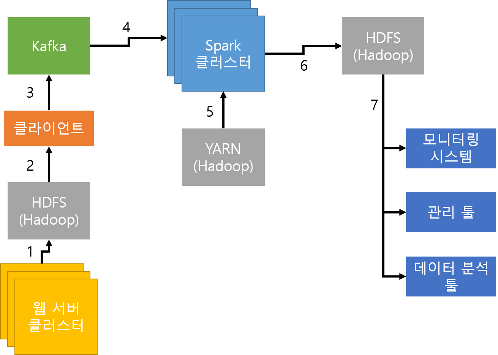

# Kafka, Hadoop, Spark

아파치의 3대 빅데이터 프레임워크.

## 빅데이터의 3대 요소

우선적으로 위 3가지 솔루션으로 처리해야 할 '빅데이터'가 무엇인지를 알아야 한다. 아래의 두 가지 정의가 보편적으로 사용된다.
* **데이터의 규모**가 너무 커 기존 데이터베이스 관리도구의 데이터 수집/저장/관리/분석 역량으로는 처리가 불가능한 데이터 (맥킨지)
* 기존과 다른 **업무 수행 방식**을 통해 *다양한 종류*의 *대규모* 데이터로부터 저렴한 비용으로 가치를 추출하고, 데이터의 빠른 수집/저장/발굴/분석을 지원하도록 고안된 차세대 기술과 아기텍쳐(IDC)

빅데이터의 3대 요소는 아래의 3가지(3V) 를 보통 말한다. 이 중 두가지 이상의 요소가 충족되면 빅데이터라 볼 수 있다.

### 크기(Volume)
* 수십 TB, 또는 PB 이상의 데이터
* 기존 파일 시스템으로는 저장조차 버거운 크기로, 분석은 더더욱 어려움
* 분산된 클러스터(Cluster) 형태의 처리장치가 요구되며, 클라우드(Cloud) 시스템과 결합되기도 함
* 구글의 GFS, 아파치의 Hadoop 등

### 속도(Velocity)
* 실시간 처리 : 데이터가 쌓이는 속도가 매우 빠르기 때문에 수집/저장/분석을 실시간으로 할 수 있어야 함
* 장기적 접근 : 그와 동시에 다양한 분석 기법과 표현을 위해 장기적인 접근 또한 필요함
* 자연어 처리, 패턴 인식, 데이터 마이닝, 머신러닝 등 대용량의 비정형 데이터를 효과적으로 처리하기 위한 기법 필요

### 다양성(Variety)
* 빅데이터는 비정형 데이터를 처리할 수 있어야 함
* 정형(고정된 필드에 저장되는 일정한 형식, 즉 SQL에 저장가능한 형식)
* 반정형(필드는 고정되지 않지만 어느정도의 스키마를 따라가는 형식. HTML이나 XML 등)
* **비정형 데이터는 고정된 필드가 정의될 수 없음. 사진, 동영상, 포스팅이나 채팅 내용 등**
  * (여기서 채팅 데이터 자체는 정형 데이터로 처리가 가능하지만, *채팅으로 친 내용*은 비정형임에 유의)
  
따라서, 채팅 데이터는 TB단위가 아니어도 빅데이터(Velocity + Variety)

센서데이터는 TB단위로 쌓일 경우 빅데이터(Volume + Velocity)

망해서 데이터가 더이상 쌓이지 않는 싸이월드의 데이터도 빅데이터(Volume + Variety)

---

---

## Kafka, Hadoop, Spark를 사용한 데이터 프로세스 예시
셋의 역할과 차이를 알아보기 위해서는 예시를 통해서 파악하는 게 필요

예시는 시스템의 일부며, 서로간의 역할은 조정되거나, 다른 외부 솔루션을 사용할 수도 있음

해당 빅데이터 시스템 구축에 관한 내용은 [Jayesh Nazre의 2017년 블로그 포스트](https://pmtechfusion.blogspot.com/2017/11/big-datadata-science-analytics-apache_20.html)에 기반하고 있으며
그동안 프레임워크에 일어난 변화를 반영하기 위해 다음 내용을 참고하였음
* [Apache Kafka 공식 문서](https://kafka.apache.org/documentation/)
* [그로윈 하둡/스팍 제품 설명](https://www.growin.co.kr/hadoop)

### [Hadoop](hadoop.md)
---

Hadoop(하둡)은 분산형 데이터의 저장 및 처리를 위해 만들어진 프레임워크로 아래와 같은 모듈로 구성됨
* HDFS : 빅데이터 저장을 위한 분산형 파일 저장시스템
* MapReduce : 빅데이터의 처리를 위한 실행 프레임워크. 병렬 배치 연산(MapReduce)기능을 사용
  * 아파치에서는 차세대 프레임워크 Apache Tez를 배포하고 있음
* YARN : 클러스터의 자원 및 스케줄링을 담당

이 아키텍쳐 예재에서는 아래와 같은 역할을 담당
* 빅데이터 처리를 위해 **Kafka 사용자\(Consumers\)** 가 사용
* **Spark**의 출력 결과를 저장
* 클러스터의 종합 관리자로 사용( **YARN** )

### [Kafka](kafka.md)
-----
다대다 빅데이터 기록/구독 스트림을 만들 수 있는 프레임워크. 아래와 같이 구성된다.

* Producer : *여러* KAFKA 토픽에 스트림을 개시시킬수 잇음 (데이터의 소스)
* Consumer : *여러* KAFKA 토픽으로부터 스트림을 받을 수 있음 (데이터의 도착지)
* Streams : *여러* 입력 스트림으로부터 데이터를 읽고 변환, *여러* 출력 스트림으로 보낼 수 있음
* Connector : 재사용가능한 Producer나 Consumer를 KAFKA 토픽에 연결시킬 수 있음

이 아키텍처에서는 Hadoop에서 받은 데이터를 Spark로 보내는 스트림을 제공하는 역할

### [Spark](spark.md)
---
여러 종류의 연산을, *인메모리*로 빠르게, 여러 대의 분산된 노드에서 연산을 할 수 있게 해주는 범용 분산 클러스터링 플랫폼.

어떠한 아키텍처에 종속되지 않은 채 하나의 툴에서 빠른 속도로, 데이터 분석과 실시간 데이터 정제, 처리, 리포팅까지 가능한 강력한 플랫폼

* Spark Core : 작업 스케줄링, 리소스 관리, 장애 복구 등 기본적인 아키텍처의 실행 관리
* Spark SQL : SQL 등 다양한 데이터소스로부터 데이터 취득 가능
* Spark Streaming : 실시간 데이터 스트림을 처리
* MLLib : 머신러닝용 라이브러니
* Graph X : 데이터의 시각화(그래프 그리기)
* Hadoop YARN, 아파치 MesOS등 클러스터 매니저 위에서 작동

### 위 아키텍쳐의 적용
---
위의 아키텍쳐는 다음과 같이 볼 수 있다.

1. Hadoop의 HDFS 데이터베이스로부터 어떠한 처리가 일어난다
2. 해당 처리로부터 발생한 데이터 스트림을 Kafka가 Producer로써 처리하고, 이를 Consumer인 Spark 클러스터로 보낸다.
3. Spark는 Hadoop YARN 위에서 동작할수도, 아닐 수도 있다.
4. Spark는 처리 결과를 Hadoop HDFS에 기록한다

아래 그림은 이를 통한 웹 로그 처리 시스템이다.

1. 웹 서버는 하둡의 HDFS에 접속한다.
2. 그 결과는 클라이언트에 로드된다.
3. 클라이언트가 어떠한 행위를 한다면, 그에 대한 메세지가 Kafka의 Producer로 작동하여 입력 스트림이 된다.
4. Spark Cluster는 Kafka의 Consumer 토픽을 맡는다. 분석되어야 할 메세지들은 Spark 클러스터로 출력 스트림을 통해 전송된다.
5. Spark Cluster는 Hadoop의 YARN 위에서 작동하고 있다.
6. Spark는 처리된 결과 데이터를 HDFS에 새로 입력한다.
7. 각종 관리자 툴 및 분석 툴은 HDFS로부터 처리 결과를 받을 수 있다. 이 데이터는 마케팅 등에 사용하거나 취약점 분석 등 보안 문제, 잘못된 결재 내역 등을 찾는 데에 사용할 수 있다.

이 시스템을 아래와 같이 변형할 수도 있을 것이다.
* 이 시스템상에서 Hadoop의 목적은 HDFS상의 빅데이터를 제공하는 용도이다. 만일, 데이터의 범위가 MySQL등으로도 커버되는 전통적인 범위라면, Hadoop은 해당 시스템에서 제외되어도 무방하다. Kafka와 Spark만으로도 시스템을 구동할 수 있는 것이다.
* Spark는 입력 데이터를 유연하게 받아들일 수 있다. Kafka 대신 다른 데이터 스트림 시스템 (Storm 등)을 사용할 수도 있고, Stream 모듈 대신 Spark SQL모듈을 사용해 다른 DBMS와 연결시킬 수도 있을 것이다.
* 굳이 모든 클러스터가 물리 서버일 이유는 없다. 클라우드 서비스를 통해 필요 사용량에 맞게 스케일링되는 시스템을 구축할 수도 있을 것이다.