# 시스템 재구축 주간 - 1.리눅스 가상머신 설치 및 Remote 원격제어 구축

지난 2주간은 빅데이터 분석을 위한 각종 툴을 맛보는 시간이었다. 리눅스 설치부터 시작해서 ELK스택, 하둡과 주키퍼, KAFKA까지 진행되었다. 거기에 조금이라도 더 편한 개발을 위해서 원격개발환경 구축에 클러스터 구축까지 진행해야 하였다.

이번 주에는 OS설치 및 원격접속 구축부터 재시작하고, 하둡 클러스터 및 Spark를 위한 파이썬/스칼라 개발환경까지 구축하여 워크플로우를 확립, 이후 학습과 프로젝트 진행에 대비하는 것이 목표이다.

 - [1. 리눅스 가상머신 설치 및 Remote 원격제어 구축](1_linux.md)
 - [2. ELK스택 설치 및 Logstash 파이프라인 구축](2_ELK.md)
 - [3. Hadoop 설치 및 데이터 로드/언로드](3_Hadoop.md)
 - [4. Metricbeat를 이용한 원격 클러스터 모니터링 시스템 구축](4_remote.md)
 - [5. Kafka와 Zookeeper 설치 및 로그 파이프라인 구축](5_kafka.md)
 - [6. Spark 개발환경의 구축](6_spark.md)

거기에 시간이 허락한다면 아래 내용도 진행할 예정이다. 지금은 외부 링크가 걸려있지만 내가 하고, 내 링크로 바꿀 것이다. 오늘의 나 말고 내일의 내가.
 - [7. Docker를 이용한 클러스터 재가상화](https://hadoop.apache.org/docs/current/hadoop-yarn/hadoop-yarn-site/DockerContainers.html)
 - [8. Kubernates를 이용한 클러스터의 완성](http://blog.madhukaraphatak.com/horizontal-scaling-k8s-part-1/)

<br>

## 1. CentOS 가상머신 구축
서버OS=리눅스는 일종의 공식과도 같은 것이다. OS는 혼자서 돌지 않는다. 항상 그 위에서 가동되는 어플리케이션 생태계가 같이 행동한다. 서버환경에서 윈도우는 분명 무시할 수 없는 비중을 차지하고 있지만, 어쨌든 대부분의 클러스터는 리눅스로 동작하고, 생태계도 리눅스 중심으로 형성되어있다. 특히, 수많은 머신마다 OS가 깔려야 하는 클러스터 환경에서, 그것도 사람이 아니라 컴퓨터 로직이 오토스캐일링(Autoscaling)하며, 기기 자체가 생겼다 없어졌다 하는데 모든 머신에 윈도우 라이센스를 박아주기엔 무언가 좀 많이 힘들 것이다. 거기서 오토스케일링되고 있을 컨테이너가 리눅스 환경일 거라는 점은 또 함정이고.

그중에서 CentOS는 서버에서 가장 안정적이라고 평가받는 래드햇 엔터프라이즈 리눅스(RHEL)의 포크 버전으로, 사실상 래드햇과 동등한 기능을 무료로 사용할 수 있기에 서버단에서 널리 활용되고 있다. ***2021년을 기점으로 이제 죽을 위기지만***.(CentOS에 협력적이었던 래드햇이 CentOS7, 8의 공식지원을 중단하고 사실상의 래드햇 오픈배타버전인 CentOS Stream만을 지원할 거라 발표했다.)

CentOS는 7을 사용할 것이다. ***더 구버전이지만 이게 더 오랫동안 사후지원될 예정이다.*** 실습시간에는 GNOME 데스크탑을 이용, Level 5 환경에서 실행하였지만, 우리는 GNOME을 사용하지 않을 것이다. *더 좋은 걸 알고 있으니까*

완벽한 클러스터를 사용하고 싶다면 원격 머신에서 작업하는게 맞겠지만 우리에겐 그럴 돈이 없다. 라즈베리파이 다수를 동원한 파이 클러스터(Pi Cluster)의 사례도 있고, 10만원 20만원짜리 노트북 다수를 동원해도 되긴 할 거다. 내키면 그렇게 하면 된다. 그런데 그 노트북 놓을 공간도 없는 나는 가상머신으로 작업할 거다. 그래도 실습시간과는 달리, VirtualBox가 지원하는 기능은 한푼도 사용하지 않을 것이다. *어차피 그것보다 이 글에서 구축할 체계가 더 편하다*.

<br>

### 1.1 필요사항 설치
VirtualBox 설치는 어렵지 않다. 윈도우에서 프로그램 까는게 하루이틀인가. [VirtualBox 공식 다운로드 링크](https://www.virtualbox.org/wiki/Downloads)로 가서 다운로드받자.

CentOS 공식 이미지도 필요하다. 우리는 어차피 다른 기능 1도 필요없으니 minimal 버전으로 받자. [CentOS 공식 홈페이지](https://www.centos.org/download/)에서 받는데, 7버전으로 받고, 용량 아까우니까 DVD 이런거 말고 minimal로 iso파일을 받아 간직하면 된다.

### 1.2 가상머신 생성 및 세팅

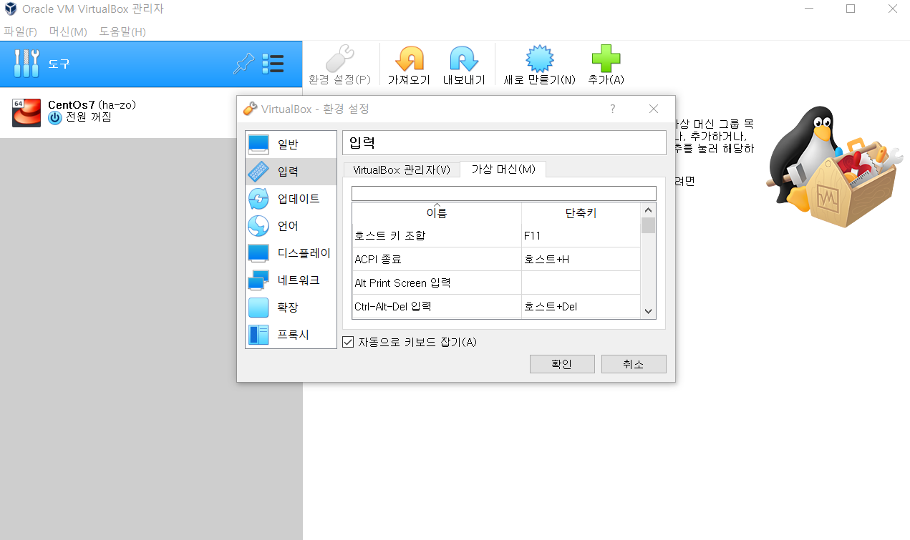

작업 도중 문제를 겪고 싶지 않다면, 호스트 키(가상머신에서 마우스 빠져나오는 키)를 변경해주어야 한다. 기본값은 오른쪽 Ctrl키인데, 많은 키보드에서 이 버튼이 사라져있거나 대체되어있는 상태라 가상머신에서 마우스가 빠져나가지 못하는 참사가 발생하곤 한다. VirtualBox를 연 뒤 좌측의 *도구*를 누르고 *환경설정 -> 입력 -> 가상 머신*으로 들어가 수정하자.


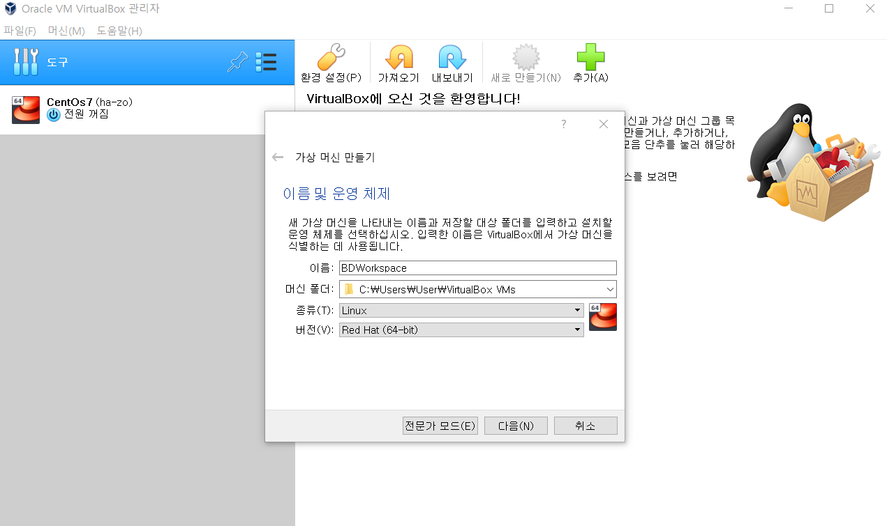

이제 가상머신을 만든다. 상단의 *새로 만들기* 클릭 뒤, OS를 우리가 원하는 CentOS로 잡는다. 가상머신을 설치할 폴더는 용량이 넉넉한 드라이브로 잡는 게 좋다.

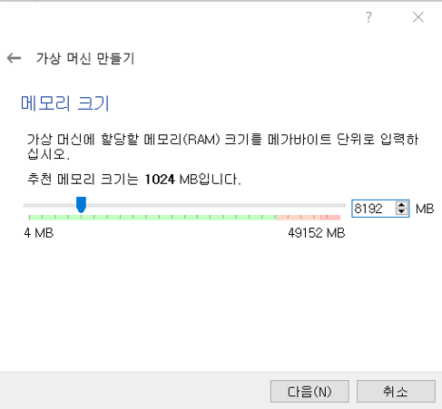

Elasticsearch의 권장사양을 직접 테스트한 바로는 [8코어에 램 16기가](https://docs.paloaltonetworks.com/cortex/cortex-xsoar/5-5/cortex-xsoar-threat-intel-management-guide/migrate-indicators-to-elasticsearch/elasticsearch-sizing-requirements.html)는 있어야 한다고 한다. 저건 제대로 돌릴 때 이야기고 절반 정도면 일단 잘 돌아가지 않나 싶다. 확실한 건, 램을 8기가도 안준다면 Elasticsearch는 구동하다가 타임아웃으로 서비스가 죽어버린다(...). 그러니까 8기가로 일단 맞춰주자.

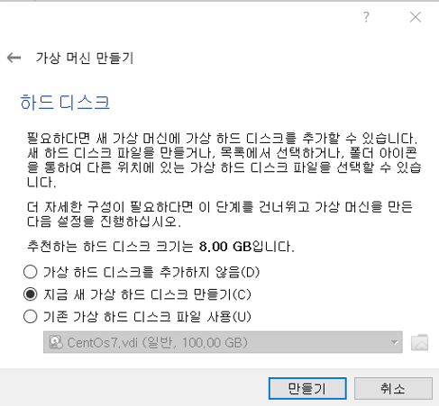

하드 디스크는 새 가상 하드 디스크를 만든 뒤, VDI, 가변 용량, (적절한 용량)을 순서대로 주면 된다. Elasticsearch 개발환경에서는 500기가 이상을 권장하고 하둡도 그정도는 권장하는데... 우린 그거 채울 하드 용량도 데이터도 없으니까 그냥 100기가로 잡았다. 용량을 가변으로 잡으면 처음부터 100기가를 먹는 게 아니라 용량이 더 필요할 때 천천히 100기가까지 늘려준다.

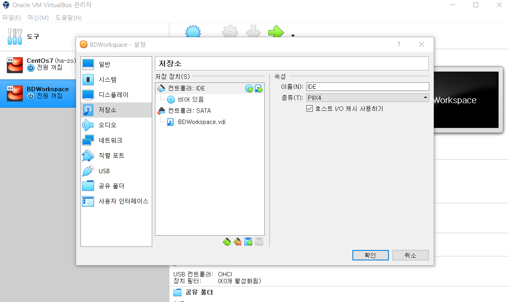

새 가상 머신이 만들어졌다면, 가상머신 -> 설정으로 들어가 저장소를 누른 뒤, 컨트롤러:IDE 옆의 CD모양을 클릭하자.


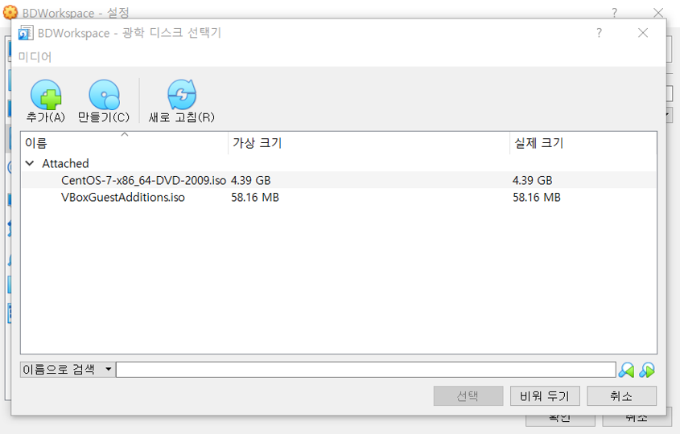

이미지의 목록이 뜬다. 기존 머신이 DVD버전이랑 연결되어 있어서 minimal버전이 보이지 않는데, 좌상단의 *추가*를 누른 뒤 아까 받은 이미지랑 연결시키고 해당 이미지를 선택하면, 저장소 창에 이미지가 로드되어 있을 것이다. 그러면 CentOS 설치 준비는 완료되었다.

### 1.3 CentOS 설치

이미지가 로드된 상태에서 설치를 진행하면 된다. 친절하게도 언어에 한국어가 있어서 큰 문제는 없다. 설정에서 건드려줄 부분은 아래쪽 정도이다.

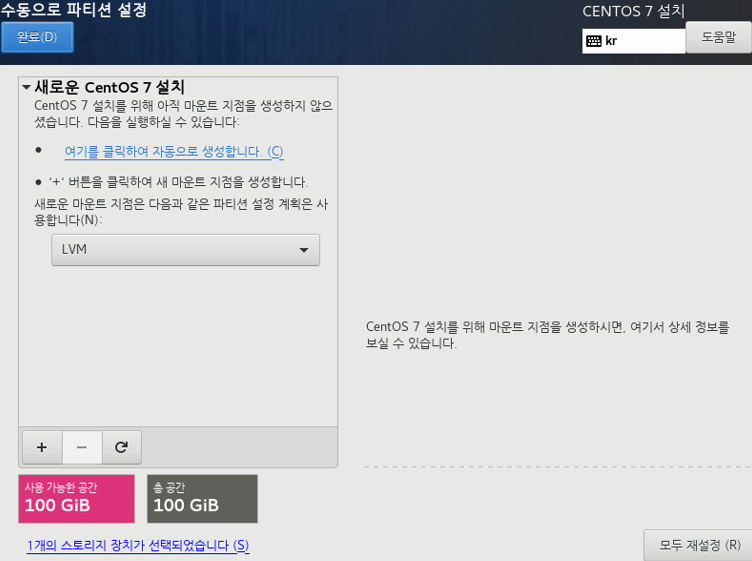

저장 장치 -> 수동으로 파티션 설정(아랫쪽쯤에 있는 체크박스) -> 완료를 누르면 위 창이 뜬다. 저기서 LVM -> 표준 파티션으로 바꾼 뒤 아래의 +를 누른다. 우리는 총 3개의 장소를 만들 건데, 설정은 아래와 같이 한다.

 - 마운트 장소 /boot : ext4, 800mb
 - 마운트 장소 /swap : 8gb
 - 마운트 장소 / : 나머지 전체

그리고 확인을 누르면 아래와 같이 표시될 것이다.

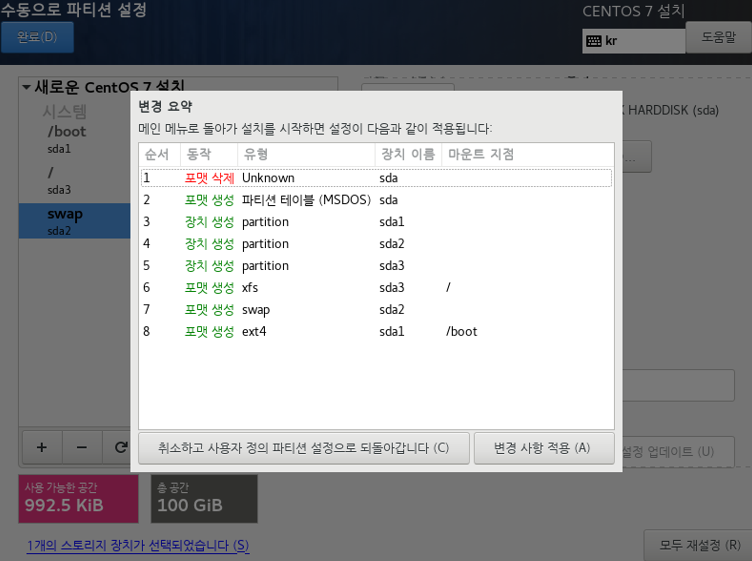

다른 부분으로, 네트워크 기본 어댑터를 켜주어야 한다. 이걸 놓쳤을 경우에는 이후 리눅스 부팅 뒤 관리자 권한으로 수동 변경이 가능하다.

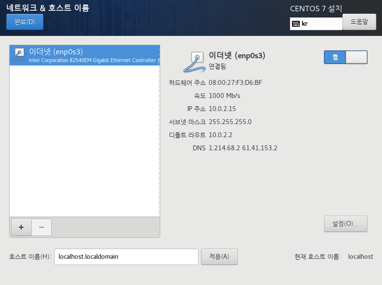

이더넷 어댑터 우상단의 *끔*으로 되어있는 스위치를 *켬*으로 올리면 된다.

최소 설치인 만큼 더 누를 것이 없긴 한데, 다른 옵션 바꿀거 있는지 찬찬히 훑어보고 있으면 바꾸고 없으면 설치를 진행하자. 설치 중 루트계정 비밀번호와 기본 계정 설정부분이 있는데, 지금 GUI가 뜰 때 진행해두는 게 아무래도 편하다. 설치 중 입력하지 않았어도 리눅스 부팅시 루트계정 비밀번호를 수정하게 될 것이다.
<br><br>

## 2. Remote와 연결

Visual Studio Code는 현 시점에서 가장 핫한 개발 도구이다. 수없이 많은 플러그인 생태계 덕에 단순한 코드 에디터를 넘어서 가장 강력한 IDE가 된 이 툴의 가장 큰 매력 중 하나라면, Remote플러그인을 통해 **리눅스 시스템을 원격지에서 마치 내 로컬 시스템의 일부인 것처럼 작업**할 수 있다는 점일 것이다.

일단, 시작할 때부터 VSCode+Remote를 사용했다가는 리눅스 터미널에 익숙해질 수가 없을 거라는 판단 하에 사용하지 않고 있었지만, 지난 2주간의 수많은 문제들 덕분에 어느정도 명령어에 익숙해진 지금 시점에서는 이 편리한 툴을 사용하지 않을 이유가 없다.

### 2.1 고정ip 설정
먼저, 리눅스에 접속하려면 ip주소가 필요하다. VirtualBox에서 다시 가상머신 설정으로 들어간 뒤 *네트워크*로 들어가 어댑터를 *네트워크에 브릿지*로 바꾸어준다. (기본값은 NAT였을 것이다.) 이렇게 바꾸면 가상머신은 마치 다른 컴퓨터인 것처럼 공유기에 직접 접속해 IP값을 받아온다.

감이 잡힌다면, 그렇다. 공유기가 없으면 이걸 써서는 안된다. 공유기가 없다면 가상머신은 인터넷 서비스 제공업체에서 ip를 받아오려 할 것이고, 돈 더 내고 ip를 2개 부여받고 있는 상태가 아니라면 인터넷이 차단당한다. 따라서 **내가 조작할 수 있는 공유기**가 있어야 제대로 Remote 네트워크를 구성할 수 있다. 내가 조작할 수는 없지만 어쨌든 공유기를 쓰고 있다면(카페 wifi 등으로 연결되어있다면) 고정ip가 없어 매번 ip를 받아야 하는 불편함만 감수하면 쓸 수는 있다. 하지만 클러스터를 쓸 때 다시 문제가 폭발할 것이다.

리눅스에서 자신의 ip를 확인하는 명령어는 아래와 같다.
```sh
ip addr
```
위 명령어로 접속하면 ip가 주르륵 뜨는데, 그 중에서 VirtualBox가 할당해 준 인터넷 어댑터 이름에 해당하는 걸 사용하면 된다. 브릿지로 네트워크 설정을 바꾸었다면 192.168.xxx.xxx 식의 ip가 할당되었을 것이다. 고정ip 설정은 **공유기**와 **PC** 두 곳에서 모두 진행해주어야 정상동작하는데, 그 역할은 아래와 같다.
 - 공유기에 고정ip가 등록되어 있다면, 해당 ip는 공유기가 자동 분배하는 ip에서 제외된다. 공유기가 고정ip를 기억하지 않는다면, 공유기가 다른 기기에게 해당 ip를 배분하고, 이후 고정ip기기가 접속할 때 ip충돌이 날 수 있다.
 - PC에 고정ip가 등록되면, PC는 공유기에 항상 해당 ip로 접속하게 된다. PC에서 이를 설정하지 않을 경우, 기본값인 자동 동적 ip로 ip를 배분받게 되고 고정ip 대신 공유기가 발급해준 ip를 받게 된다.

위는 어디까지나 일반적인 상황이고, 공유기 기종에 따라 고정ip를 받은 호스트를 기억하였다가 해당 호스트 접속시 재할당해주는 등의 부가 기능이 존재할 수는 있다. 최악의 경우, LG사의 일부 공유기처럼 고정ip 할당 옵션 자체가 없을 수도 있다.(바보가 아닌 이상 그런 공유기를 돈주고 사진 않았을 거고 보통 '이거 기가와이파이에요'하면서 TV 살때 같이 놓아주었을 거다.) iptime같이 공유기를 전문으로 제조하는 업체는 당연히 고정ip옵션을 제공한다.

고정ip 설정은 각 공유기마다 다르니 참고해서 설정하자. 다음으로는 리눅스 PC에서도 고정ip를 걸어주어야 할 것이다. 아래 명령어로 네트워크 설정 파일을 들어간다.
```sh
sudo vi etc/sysconfig/network-scripts/ifcfg-enp0s3
```
어댑터 이름이 다르다면 파일명이 다를 수 있는데, cd명령어로 해당 경로에 들어간 뒤 ls명령어로 내용물을 확인하자. ifcfg-(어댑터명) 형식의 파일로 접속하면 된다.

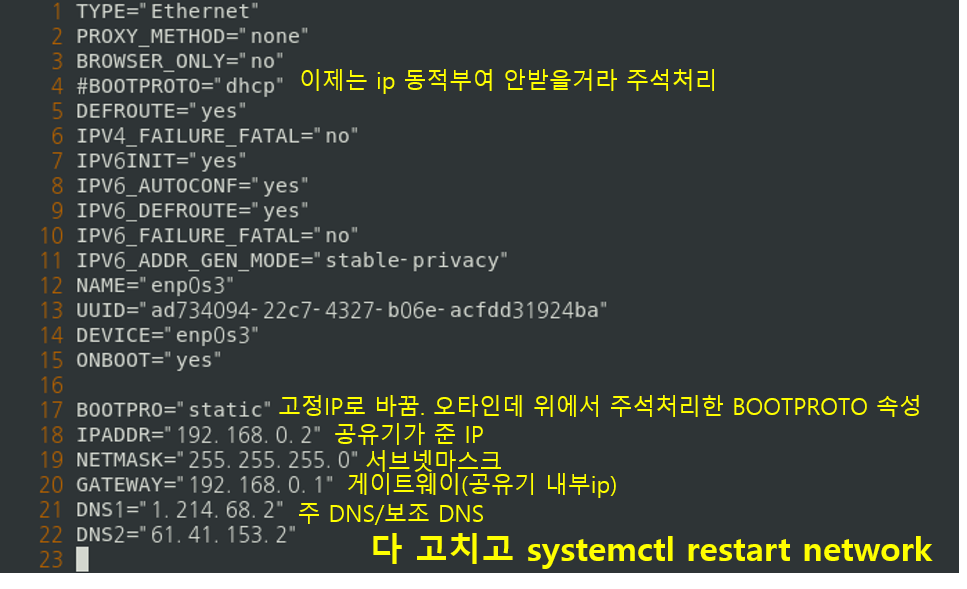

대충 저렇게 입력하면 된다. 주의할 점은, IPADDR을 제외한 나머지는 모두 공유기의 속성이라는 것. 각 공유기마다 조회하는 위치는 다르지만 네트워크 정보, DHCP정보 등에 표시되니 잘 보고 따라하자.

vi에서 수정모드(정확히는 삽입모드)로 들어가려면 i키를 누르고, 수정이 끝난 뒤에는 ESC로 수정모드를 빠져나온 뒤, :wq를 입력하면 기존 파일을 덮어쓰기(w)하고 vi를 나간(q)다. 그 다음 그림에도 쓰여있지만, 아래 명령어로 네트워크 시스템을 재시작해 수정내용을 반영한다.
```sh
sudo systemctl restart network
```
설정이 완료된 뒤에는 다시 ip addr 명령어로 고정ip 할당이 완료되었는지 확인하고(아니면 공유기 설정페이지 가서 ip 발급현황을 봐도 된다) 어차피 업데이트도 해야 할 겸, 아래 명령어로 인터넷이 잘 도는지 확인하자.

```sh
sudo yum upgrade -y
```
뭐가 주르륵 뜨고 막 설치하고 있다면, 잘 되고 있는 것이다. 오류가 뜬다면 설정파일을 잘 설정했는지 다시 확인해보자.

### 2.2 SSH 키 생성
리눅스 시스템에서 SSH키는 (계정폴더)/.ssh/authorized_keys에 등록되어야 한다. 이 키에는 **이 계정으로 접속 가능한 모든 시스템의 SSH 공개키**가 들어가 있어야 한다. 나중에 하둡 할 때 등 *내가 나한테 SSH접속을 해야 할 경우*도 발생할 것이므로 먼저, 리눅스 시스템에서 만든 키를 리눅스에 넣으며 대략적인 흐름을 파악하자.

개발시스템인데 VSCode는 원격지에 있다보니 만큼 루트로 들어가서 ssh를 뚫어야 온갖 권한문제로부터 자유로워지므로 일단은 ```su -```로 루트계정에 들어가지만, 실재로는 권한을 세부적으로 설정한 뒤 해당 계정으로 사용하는 게 바람직할 것이다. 일단, 지금은 루트로 하자.

```
su -
ssh-keygen
```
ssh-keygen 명령어는 내 계정에 해당하는 ssh 키 파일을 만든다는 것이다. 아마 맨 처음 설치경로를 물어보고 그 다음 passphrase라는 걸 물어볼 것이다. 키 설치경로는 그냥 엔터로 넘겨서 기본값으로 하고, passphrase도 넣지 말고 엔터로 넘긴다. passphrase는 일종의 키에 대한 비밀번호인데, 암호를 복호화했을 때, 해당 passphrase가 나오는 경우만 통과시킨다는 개념이다. 상대측 클라이언트가 해킹당했어도 passphrase를 모른다면 공격자가 인증키를 사칭해서 접속할 수 없게 하는 추가적인 보안수단이다. 내가 나한테 접속할 때 그런짓을 할 필요는 아무래도 적은 만큼 (내 SSH키가 해커한테 넘어갔다면 이 서버가 넘어갔다는 소리인데, 그러면 SSH키를 굳이 안빼앗아도 어차피 이미 파일이고 시스템이고 다 뺏어갈 수 있다...) 여기서는 걸지 않을 것이다. windows에서 넘길 때 걸 거다. 키가 다 만들어지면 뭔가 이미지가 생길 텐데, 그거 캡쳐해서 인터넷 올리거나 하지 말자. 키 뺏긴다. 은근히 많이 터지는 보안사고 중 하나가 비밀번호나 RSA키를 멋모르고 Git같은 데에 올려버리는 건데, **아주아주아주아주아주 치명적인 실수이므로** (실사례들을 보면 단순히 사표 수준에서 끝나지 않는다) 주의하자.

이제 아래 명령어를 순서대로 입력해서 키 파일을 조회하자.
```sh
cd ~/.ssh
ls
```
id_rsa, id_rsa.pub라는 두 파일이 존재할 텐데, 확장자가 없는 파일이 개인키, pub파일이 공개키이다. 개인키는 내가 가지고 있는거고 공개키는 '이 키로 메세지가 해독되면 제가 보낸 메세지입니다'라고 뿌려주는 키다. 따라서 개인키는 어디 잘 보관하고 공개키를 인증 서버에 등록하면 된다. 인증 서버에 등록하는건 몇몇 방법이 있겠지만, cat명령어를 쓰는 게 아무래도 간단하다.
```sh
cat ~/.ssh/id_rsa.pub >> ~/.ssh/authorized_keys
```
지금이야 키를 처음 만드는 거라 >랑 >>가 문제가 없지만 앞으로는 항상 **>>** 만 써야 한다. >로 하면 파일을 덮어씌우는 거고 >>로 하면 파일 뒤에 이어서 기록하는 거다. 기존 인증 정보 다 날리기 싫다면 명심하자.

vi로 authorized_keys를 열어보면 아래와 같이 생겼다.

```
ssh-rsa xxxxxxxxxxxxxxxxxxxxxxxxxxxxxxxxxxxxxxxxxxxxxxxxxxxx root@localhost.localdomain
```
키 타입 - 키 내용 - 해당 계정의 꼴이다. 이제, 밖에서 ssh 연결을 요청할 때, 해당 요청자의 키가 등록되어 있다면, 입력된 공개키를 기반으로 메세지를 복호화해 인증을 진행하게 된다. 위에서 cat 쓸때 >를 한번만 넣는 실수를 했다면? 기존에 등록된 키는 다 날아갔을테니 요청자의 키가 없다면서 ssh연결을 거부할 것이다.

이번에는 윈도우에서 만든 ssh키를 집어넣을 시간이다. 윈도우에서 key를 만들기 위해서는 **오픈ssh 클라이언트**를 설치해야 한다. 사실, 리눅스에서도 이걸 깔아야 ssh-keygen이 되는데 CentOS 기본패키지에 포함되어 있을 뿐이다.

윈도우 검색창에 '선택적 기능'을 검색한 뒤 들어가서 기능 추가 -> openSSH 클라이언트를 설치하자. 그 다음, 명령 프롬프트를 실행시켜 리눅스에서 키 만들 때랑 똑같이 진행한다.

```
ssh-keygen
```
리눅스랑 똑같이 얘도 openssh이므로 똑같이 진행되는데, 여기서는 passphrase를 거는게 원칙적으로 좋다. 내가 나한테 접속하는게 아니라 원격지 컴퓨터에 접속하려는 것이므로 passphrase를 입력해두어야 내 컴퓨터가 탈취당해도 원격지 컴퓨터를 방어할 수 있다.

자 어쨌든 이제 키가 준비되었으니 공개키를 인증서버의 authorized_keys에 SSH를 통해 등록시키면 된다. SSH는 키가 필요하니 이제 키를 통해서 인증서버에 접속해 키를 등록시키면.... 이거 계란이 먼저냐 닭이 먼저냐 꼴이잖아.

SSH키 없이도 기본적으로 SSH 연결이 가능하다. 계정과 계정의 로컬 비밀번호를 알고 있으면 된다. 이건 보안문제가 있으니 SSH연결이 완성되면 막아버려야 할 기능이지만 연결을 만들기도 전에 막아버리면 외부에서 접속할 길이 없다. 따라서, 첫 연결에서만 비밀번호를 써서 접속해 키를 입력해 둔 뒤, 이후에는 비밀번호 연결은 막고 SSH키로만 접속하면 된다.

인터넷상에는 이 첫 연결을 뚫는 과정에서 온갖 방법들이 동원되는데, 복잡한 스크립트, 추가적인 프로그램 설치 같은것 없이, 우리의 목표인 Remote를 지금 동원하면 너무나도 쉽게 가능해진다.


### 2.3 Remote-ssh를 통한 원격머신 접속 및 SSH키 등록
먼저 Visual Studio Code를 열고 (없으면 설치해두자) 왼쪽의 네모 네 개 아이콘을 클릭해 Extension 탭으로 들어가 remote를 검색하자. 그러면 remote-ssh를 찾을 수 있을 거고, 설치하면 된다.

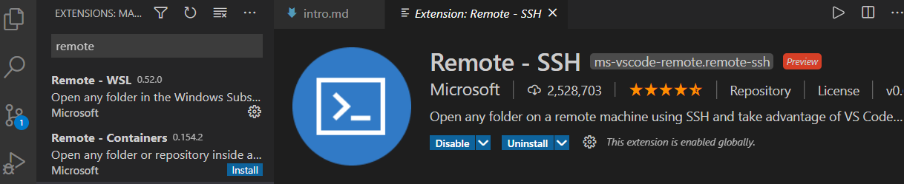

그 다음, F1키 또는 Ctrl+Shift+P를 눌러 상단 명령창을 연 뒤, Remote-ssh:connect to host로 들어간다. 그러면 호스트 이름을 묻는 창이 뜰 텐데, 우리가 연결을 열고자 하는 계정, 즉 **root@호스트 ip**를 치면 새로운 VSCode 창이 뜰 것이다.

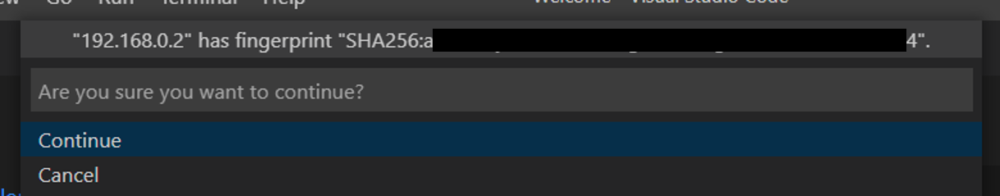

첫 연결에서는 위 창이 뜰 것이다. 저 fingerprint는 해당 장치의 고유한 키로, 내가 접속하는 장치가 그 장치가 맞는지를 확인하는데에 사용된다. 접속시 이는 윈도우 기준 사용자 폴더의 .ssh폴더 아래 known_host라는 파일로 저장되고, 이후 ssh연결을 다시 하려고 할 때 fingerprint가 달라졌다면 해킹시도로 간주, 연결을 차단한다. 어쨌든, 위 창에서 continue를 눌러 fingerprint를 등록하고 ssh연결을 시작하자.

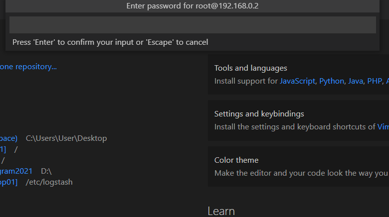

조금 기다리면 비밀번호를 묻는데 루트 비밀번호를 입력하고 엔터를 치면 된다. 그러면 vscode가 vscode-server라는, vscode 원격접속을 위한 패키지를 원격장치에 설치하기 시작한다. 그 과정에서 한두번 더 비밀번호를 물을 테니 그때마다 입력해주자.

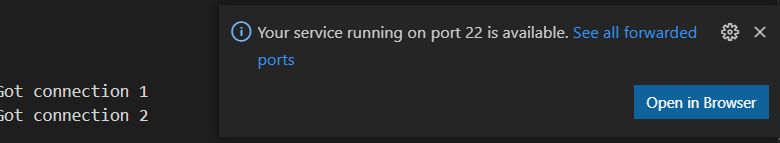

창 우하단에 ssh 연결용 포트(기본값 22번)이 열렸다고 표시되면 연결이 완료된거다.

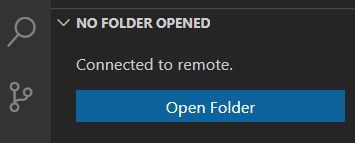

이제 폴더를 열어 /root/로 들어가주자.

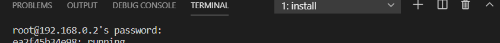

이 과정에서 갑자기 timeout으로 연결이 날아가버리는 경우가 생겨서 좀 헤맸는데, 로그인창이 위에 안뜨고 터미널에 떠있었다. 연결 끊기기 싫으면 창 아래쪽에서 terminal 열어두고 비밀번호 물어보면 재깍재깍 대답해주자. (확인해보니 내가 옵션을 켜버렸다. 원래는 상단에 뜨는데 터미널에 뜨게 세팅값을 바꾼거니... 세팅 건드리지 말자.)

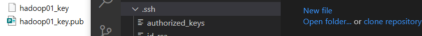

Remote 플러그인을 설치했으니 그냥 드래그하면 키가 복사된다. 윈도우에서 만들어둔 pub파일을 복사해서 .ssh 폴더 아래에 붙여넣자.

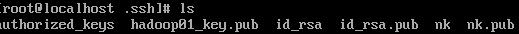

이제 리눅스에서 ls명령어를 사용해서 보면 아까 집어넣은 키가 보인다. 이것도 cat명령어로 authorized_keys에 복사해놓자.

### 2.4 등록된 키를 통한 SSH연결

다시 연결을 시작한다. 이번에는 옵션 파일을 만들고, SSH키를 통해 접속할 것이다. 아까 연결한 창은 닫고, 원래의 VSCode 창에서 다시 F1 또는 Ctrl+Shift+P > Remote-SSH:Add new SSH Hosts로 접속한다. 그 다음 아까처럼 계정명@ip주소를 쳐서 접속대상을 정한 뒤 엔터를 치고, 위쪽 파일로 연결해주면 VSCode 우하단에 호스트가 추가되었다고 뜰 것이다. 여기서 Open config file를 열어야 하는데, 놓쳤다면 다시 명령어에서 Remote-SSH:Open configuration file을 눌러 들어가자. 그리고 아래와 같이 파일을 작성한다.

```
Host hadoop01
  HostName 192.168.0.2
  User root
  IdentityFile c:\hadoop01_key
```
여기서 IdentityFile을 제외한 나머지는 방금 Add new Host를 통해 등록되어 있었을 것이다. 여기서 Host 옆의 이름을 바꾸는 건 선택사항. HostName과 User는 그대로 두고, IdentityFile 속성을 추가해 내 SSH 개인키의 경로를 적어준다. 그러고 나서, 다시 접속을 시도하면

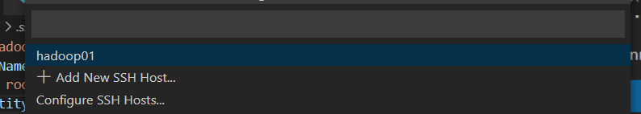

이렇게 아까 만든 호스트가 뜨고, 그 호스트를 선택하면 접속이 시작되는데,

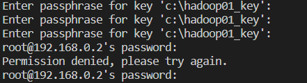

루트 비밀번호 대신 passphrase를 묻는다.

세 번 틀리면 루트 비밀번호 인증으로 인증 방식을 바꾼다.


## Remote를 통한 리눅스 조작, SSH 키 없는 인증 닫기
이제 접속이 완료되었으니, 뭘 할 수 있는지 찾아보자.

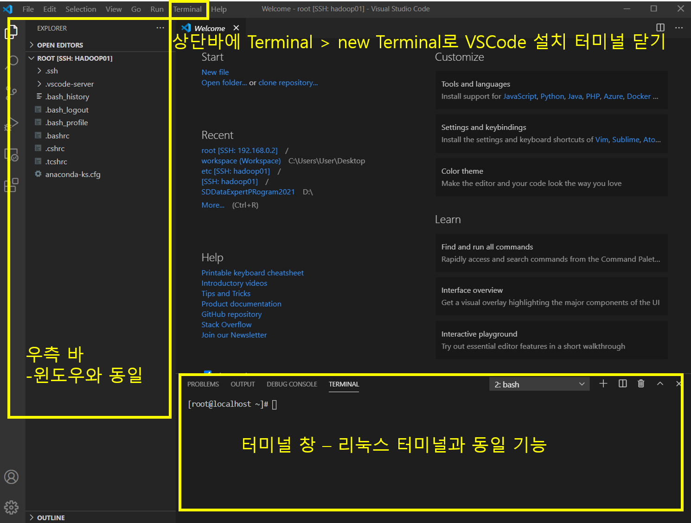

기본적으로 윈도우에서 VSCode를 쓰는 것과 큰 차이가 없다. 다만 리눅스 환경 내에서 실행되는만큼, Extension은 윈도우(Local)과 리눅스(Remote)에 서로 따로 설치되어야 하는데, 단순한 에디터 기능(코드 강조 등)은 리눅스쪽에 깔려있을 필요가 없으며, 리눅스에서만 사용될 실행 관련 플러그인은 로컬에서 활성화되어있을 필요는 없다. 대개, 그냥 install만 눌러주면 알아서 착착 설치해주니 걱정할 필요는 없다. 다만 원격 설치인 만큼 빠릿하게 되진 않으니 옛날 사양낮은 컴퓨터 쓰는 느낌으로 느긋하게 쓰는 게 좋다.

SSH키를 통한 연결을 활성화했는데 비밀번호 연결을 그대로 열어두면 보안에 구멍을 하나 뚫어놓은 상태이다. 우리는 루트 계정으로 접속한 만큼, Remote 상에서 SSH 비밀번호 연결을 막아버릴 수 있다. 이를 설정하기 위해 먼저 현재 접속되어있는 /root가 아닌 /etc에서 작업해줄 필요가 있다. VSCode로 연 터미널에 아래 명령어를 입력하면 새로운 VSCode 창이 뜰 것이다.

```
code /
```
또는 Open folder 명령어를 사용해도 된다.

그러면 최상위 디렉토리에서 vscode가 열렸으므로 모든 폴더에 접근할 수 있다. ssh 서비스인 sshd의 설정에 접근해서 비밀번호 로그인을 차단하자.

좌측의 폴더 탐색기를 통해 /etc/ssh/sshd_config파일에 접근한다. vi로 열 거 없이, 클릭하면 VSCode 편집기에 해당 창이 뜰 것이고, 거기서 Ctrl+F로 PasswordAuthentication을 찾아 아래와 같이 바꾼다.
```
PasswordAuthentication no
```
이후 sshd를 재시작하면 더이상 비밀번호인증은 사용할 수 없게 된다. 하지만 우리는 키를 가지고 있는 컴퓨터에서, passphrase를 알고 있다면 root권한 접속이 가능하다.


